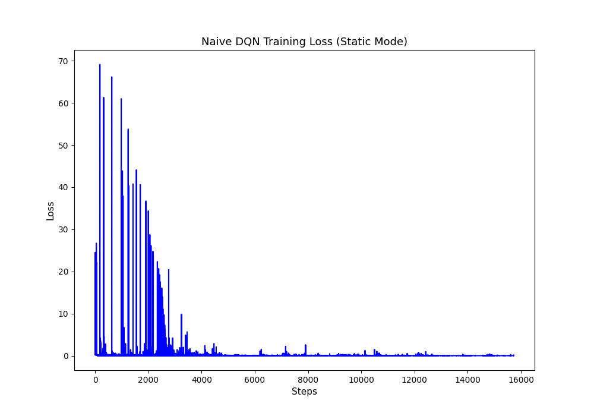
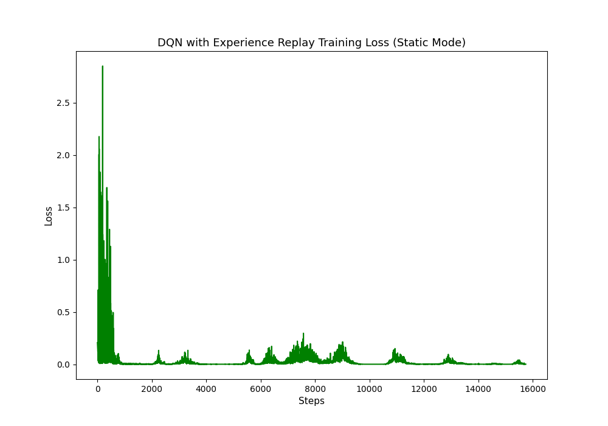
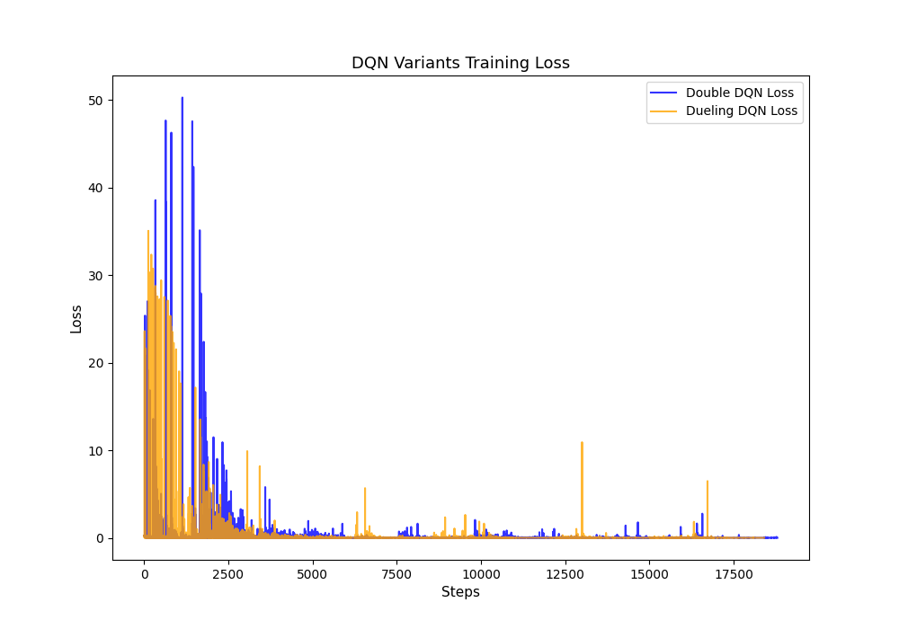
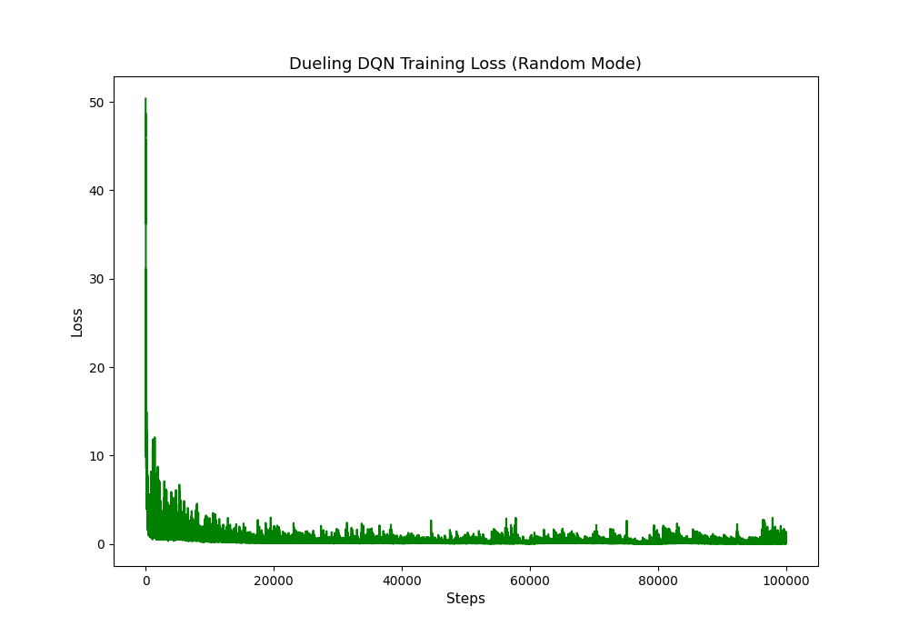

# Deep Reinforcement Learning HW3: DQN and its Variants

本專案為深度強化學習作業三的實作，涵蓋了基礎的 Deep Q-Network (DQN) 以及其多種變形架構（Double DQN、Dueling DQN），並探討了在不同的 `Gridworld` 環境模式下（Static、Player、Random）各種輔助訓練技巧（例如 Experience Replay、Target Network、Reward Shaping）對神經網路收斂表現的影響。

---

## HW3-1: Naive DQN 與 Experience Replay 的比較 (Static 模式)

### 作業內容
本階段的目標是訓練一個智能體 (Agent) 在固定起點、目標點與陷阱的 `static` (完全靜態) 環境中，學會走到目標並避開陷阱。我們透過比較「不包含任何技巧的 Naive DQN」與「加入經驗回放緩衝區 (Experience Replay Buffer) 的 DQN」，來觀察 Experience Replay 對於訓練穩定性的影響。

### 結果圖與分析

#### 1. Naive DQN (無 Experience Replay)

由於連續時間步產生的訓練樣本具有極高的時間相關性，違反了 SGD 所需的獨立同分布假設，神經網路容易對近期樣本過度擬合。雖然在 Static 模式下起點與目標固定，Naive DQN 最終能硬生生背出最佳路徑，但在訓練初期的 Loss 曲線可以明顯看到激烈的震盪波動。

#### 2. DQN 加上 Experience Replay Buffer

加入 Experience Replay 後，資料是從歷史中隨機抽取的 Mini-batch，打破了連續資料間的相關性 (Decorrelation)，大幅降低了更新方向的偏誤。由上圖可見，Loss 下降曲線變得更加平滑且穩定，早期的震盪幅度大幅縮小，提升了資料使用效率與收斂品質。

---

## HW3-2: 網路結構比較 - Double DQN vs Dueling DQN (Player 模式)

### 作業內容
本階段旨在觀察純粹的網路結構改良對於學習表現的影響。為了將「結構」與「輔助技術」解耦，我們在 `player` 模式下**拔除了 Experience Replay Buffer 與 Target Network 的週期性更新**（僅保留 Double DQN 計算所需的評估網路），單純比較 Double DQN 與 Dueling DQN 的特性。

### 結果圖與分析

### Double DQN 與 Dueling DQN 比較

| 特性 | Double DQN (DDQN) | Dueling DQN |
|------|-------------------|-------------|
| **核心目標** | 解決基礎 DQN 中 Q 值被「過度高估 (Overestimation)」的問題。 | 加強神經網路對「狀態本身價值」的評估能力，不受動作影響。 |
| **結構設計** | 結構與基礎 DQN 相同，但在計算目標值 (Target) 時，將「動作選擇 (由主網路負責)」與「動作評估 (由目標網路負責)」分離。 | 改變了網路的輸出層結構，將其拆解為兩個分支：**狀態價值流 $V(s)$** 與 **優勢流 $A(s, a)$**，最後再合併輸出 $Q(s,a)$。 |
| **優勢場景** | 當環境充滿雜訊或動作影響極大，容易因 Max 運算而高估 Q 值導致策略次佳時，DDQN 表現卓越。 | 當某些狀態下「選擇什麼動作根本不重要（例如前面是死路）」時，網路不需要費力去學習每個動作的精確 Q 值，只需學習到 $V(s)$ 很低即可，這在具有許多相似動作的環境中特別有效。 |
| **實驗表現** | 在未依賴 Experience Replay 的情況下，雖然能減少高估，但面對對手隨機行為 (`player` 模式) 時，策略泛化能力稍弱。 | 在本實驗中表現較佳，因為它能更好地萃取出網格環境中「狀態本身」的好壞，面對變化較大的對手行為時，策略選擇更具韌性與泛化能力。 |

**結論**：實驗結果顯示，即便沒有 Experience Replay 的加持，改良後的網路結構在 `player` 模式下依然展現出學習能力。其中 **Dueling 架構因為能更有效地評估狀態價值，在面對會移動的對手時，表現明顯勝過 Double DQN**。

---

## HW3-3: 整合所有進階技巧與 PyTorch Lightning (Random 模式)

### 作業內容
在最困難的 `random` 模式中，起點、目標與陷阱位置每次皆會隨機生成。單靠網路結構改良已無法克服高度隨機環境帶來的訓練震盪。因此，我們使用 **PyTorch Lightning** 重構了模型，並加入了所有的終極訓練技巧：
- **完整架構**：Dueling DQN 結合 Double DQN 目標計算。
- **輔助技巧**：Experience Replay Buffer、Target Network、Epsilon-Greedy 線性衰減、Gradient Clipping、Learning Rate Scheduler。
- **防撞牆機制 (Anti-wall Collision Reward Shaping)**：當 Agent 試圖往牆壁移動導致原地踏步時，給予 `-10` 的嚴厲懲罰，促使策略快速學習避開無效甚至有害的行動。

### 結果圖與分析

在整合所有技術並引入 Reward Shaping 後，模型在高度隨機的環境中成功突破了瓶頸：
- **Loss 極速收斂**：如圖所示，Loss 在經歷極短期的探索階段後便平滑地收斂至極低值。
- **高勝率與泛化能力**：不僅 Loss 收斂良好，Agent 也學會了高度泛化的策略，能夠快速適應每次初始隨機變動的環境，達成卓越的勝率表現。

---

## 整體總結
本次作業證實了：
1. 在簡單靜態環境下，基礎的 DQN 雖然不穩定但仍可死背出策略。
2. **Experience Replay** 與 **Target Network** 是打破資料相關性與穩定 Q 值估計的基石。
3. **Double / Dueling 架構** 能改善價值高估偏差並增強對狀態價值的理解。
4. 面對高度隨機性環境時，不僅需要整合上述所有架構與技巧，**Reward Shaping**（如防撞牆懲罰）更是有效引導 Agent 收斂、突破盲點的關鍵鑰匙。
